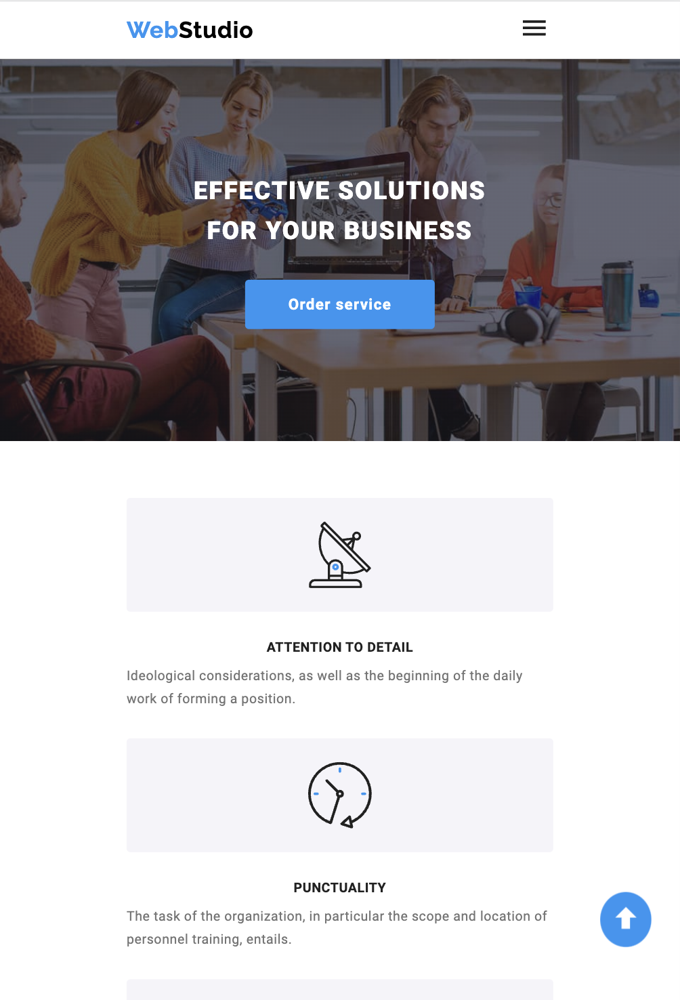
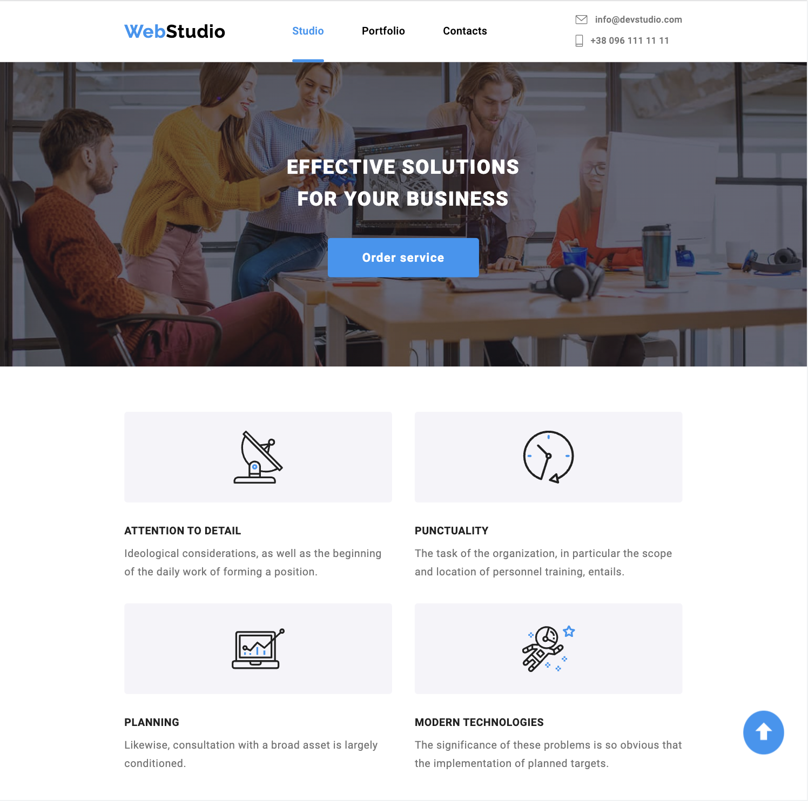

# WebStudio website
Personal markup project

## About website
The website for a small Web studio located in Kyiv, Ukraine. The site has a home page where you can learn more about the company and the services it provides, its team, and has a modal window where you can order a service. For the mobile version there is a mobile menu. On the Portfolio page you can see a list of previously completed projects. Website is adapted for all types of devices and all images adapted for retina screens.

## Technology stack

<ul>
  <li>HTML</li>
  <li>CSS</li>
  <li>SASS</li>
  <li>JS</li>
</ul>

## Page screenshots for different devices

  
    

